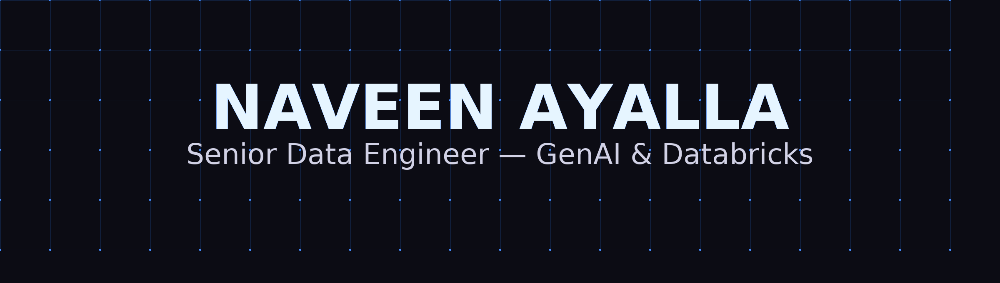

<!-- Banner -->

  

<h1 align="center">Hi, I'm Naveen 👋</h1>
<h3 align="center">Senior Data Engineer — GenAI • Databricks • Cloud Modernization</h3>

  

---

## 🔧 Toolbelt (always visible — local icons)

   
   
   
   
   
   
   
   
   
   
   
   
   
   
   
   
   
   
  

---

## 🧭 Table of Contents
- [About](#about)
- [Signature Projects](#signature-projects)
- [Playbooks & Templates](#playbooks--templates)
- [Dashboards & Analytics](#dashboards--analytics)
- [GitHub Stats](#github-stats)
- [Contact](#contact)

---

## About
I build reliable, scalable **data platforms** and **AI-assisted ETL**. My work spans **cloud migrations**, **streaming**, **data quality/observability**, and **agentic analytics** that explain pipelines in natural language.

---

## 🚀 Signature Projects

### 1) Adobe — **GenAI ETL Migration (SAP HANA ➜ Databricks)**

        

**Problem**: Legacy SPs in HANA were hard to maintain and slow to iterate.  
**Solution**: Replatformed dozens of SPs into **PySpark on Databricks**, implemented **SCD2 history**, **DQ metrics**, and **parity tests**. Built a **Mosaic LLM agent** to explain notebook logic, propose fixes, and auto-generate orchestration tasks.  
**Architecture**: SnapLogic ➜ Databricks Jobs ➜ Delta Lake (Main + History) ➜ MLflow metadata ➜ DQ dashboards.  
**Impact**: ~40% faster runtime, **self-documenting** pipelines, safer deployments.

---

### 2) Southwest Airlines — **Real‑Time Ops (Kafka/Kinesis + Neptune Graph)**

       

**Problem**: Fragmented event data (crew, gates, tickets) limited operational response.  
**Solution**: Built **Kafka/Kinesis** pipelines (1M+/min), modeled **crew/route/asset** as a **Neptune** graph, and transformed streams in **Databricks + dbt**.  
**Architecture**: Producers ➜ Kafka/Kinesis ➜ Databricks Structured Streaming ➜ dbt models ➜ Neptune graph queries.  
**Impact**: **99.95%** SLA, −35% latency in decision loops, lower ops costs.

---

### 3) Thermo Fisher — **Life Sciences Email Analytics (A/B + Attribution)**

      

**Problem**: Multi‑channel email events (15M+/day) with weak attribution.  
**Solution**: Centralized events into **Delta Lake**, standardized **dbt** models, added **statistical A/B**, anomaly detection, and attribution.  
**Impact**: Verified ~**18%** true lift, **+40%** insight velocity, cleaner campaign analytics.

---

### 4) Eloqua ➜ Modern Stack **End‑to‑End Migration**

      

- Ingest + normalize Eloqua data, **dbt** semantic layers, **CI/CD** orchestration  
- Activation-ready tables for BI and downstream CRM sync  
- Result: Lower time-to-insight, strong lineage & governance

---

### 5) ADP — **Revenue & Incentive Analytics**

     

- Automated payroll/revenue pipelines with **auditing & controls**
- Built trusted **finance dashboards** and anomaly alerts 
- Result: Improved compliance visibility and reduced manual ops

---

### 6) ETS — **Student Journey Analytics (GRE/TOEFL)**

     

- Funnel + fallout analytics across registration and prep flows  
- Scalable infra via Terraform + dbt + Delta Lake  
- Result: **+14%** registration completion

---

## 📚 Playbooks & Templates
- **Delta Lake SCD2 Upserts**: main + history pattern, audit columns, soft deletes
- **DQ Metrics Layer**: run logs, parity checks, thresholds, anomaly detection hooks
- **Agentic Explainers**: RAG over notebooks + metadata; “why did my job fail?” in English
- **ELT Migration Checklist**: from legacy SPs to PySpark/dbt with test harness

---

## 📊 Dashboards & Analytics
- **Ops KPIs**: latency, SLA, error budgets
- **Marketing Performance**: causal lift, cohorts, channel mix
- **Finance**: incentive accruals, variance analysis, audit readiness

---

## GitHub Stats

  
  

---

## 🐍 Animated Contribution Snake
> Auto‑generated daily by GitHub Actions

  

---

## Contact

